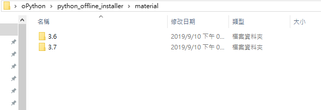

# Python offline install - package 離線安裝方法說明

1. **先在有網路環境下的機器先行下載完所有套件**，以本次為例主要有: numpy、pandas、psycopg2、zipcodetw，但上述部分僅為我們已知需安裝的 Library，有可能有連動其他 Library 的情況，請用 pip freeze 在 command line 查詢:

	* numpy==1.16.1
	* pandas==0.24.1
	* psycopg2==2.7.7
	* python-dateutil==2.8.0
	* pytz==2018.9
	* six==1.12.0
	* unicodecsv==0.14.1
	* zipcodetw==0.6.1
		
		
>     * 註: 上述為 <套件>==<版本>

2. 請根據上述的套件與版本至 [Python Package Index][pypi_url] 進行查詢，找到相對應的版本安裝包進行下載，如圖:

	
		
3. 除了上述套件，還需至 [Python Package Index][pypi_url] 下載協助安裝的安裝套件，本次是使用: pip、setuptools
	
4. 將上述所有安裝套件，**放置在 offline_install 的 [material](./material) 資料夾中(若有關連性順序問題的話要在該檔案前綴數字)**，此設定將作為程式的安裝順序，如下圖

	
	
	若遇到多個環境卻不同 Python 版本狀況，可在 [material](./material) 下新增對應版本的資料夾。
	
	* 舉例來說，Python 3.6 版本的 Library 放置在 [material/3.6](./material/3.6) 資料夾下，以此類推，Python 3.7 版本的 Library 就放置在 [material/3.7](./material/3.7) 資料夾下
	
	
	
	* 並記得去修改 [install.bat](./install.bat) 的 [指定安裝路徑](https://github.com/OftenLin/python_offline_installer/blob/cf3e38db1c9ae9899fb3250c9067205d5fb41930/install.bat#L10) 成該環境下相對應 Python 版本的路徑 
	
>     * Ex: 若為 Python 3.7 版，就將 install.bat 中的 set install_folder=%~dp0material\3.6 改成 set install_folder=%~dp0material\3.7 
	
	
5. 下載完成後到資料夾 offline_install 執行 [install.bat](./install.bat) 可開始在離線環境下執行套件安裝

6. (Optional, 如有需要)若想要清除重裝，可以直接執行 [uninstall.bat](./uninstall.bat)

[pypi_url]:https://pypi.org/
