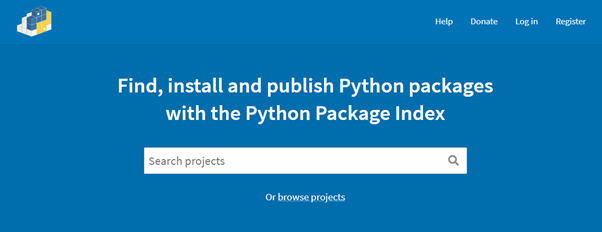
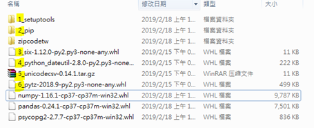

# Python offline install - package 離線安裝方法說明

1. **先在有網路環境下的機器先行下載完所有套件**，以本次為例主要有: numpy、pandas、psycopg2、zipcodetw，但上述部分僅為我們已知需安裝的 Library，有可能有連動其他 Library 的情況，請用 pip freeze 在 command line 查詢:

	* numpy==1.16.1
	* pandas==0.24.1
	* psycopg2==2.7.7
	* python-dateutil==2.8.0
	* pytz==2018.9
	* six==1.12.0
	* unicodecsv==0.14.1
	* zipcodetw==0.6.1
		
>     * 註: 上述為 <套件>==<版本>

2. 請根據上述的套件與版本至 [Python Package Index][pypi_url] 進行查詢，找到相對應的版本安裝包進行下載，如圖:

	
		
3. 除了上述套件，還需至 [Python Package Index][pypi_url] 下載協助安裝的安裝套件，本次是使用: pip、setuptools
	
4. 將上述所有安裝套件，**放置在 offline_install 的 [material](./material) 資料夾中(若有關連性順序問題的話要在該檔案前綴數字)**，此設定將作為程式的安裝順序，如下圖

	
		
5. 下載完成後到資料夾 offline_install 執行 [install.bat](./install.bat) 可開始在離線環境下執行套件安裝

[pypi_url]:https://pypi.org/